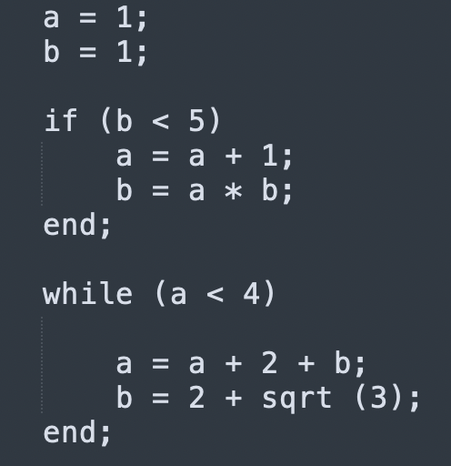

# LANGUAGE
My programming language. It's actually a mixture of Pascal and Python.
It was hard to do, but possible. 

## How is the implementation going ?

1) Create an array of nodes, where will the entry from the file with the executable code go;

2) Sequentially go through the file and write information about the read object to each node. Types of nodes:

operation (>, <, !=, =, ==, ;, +, -, *, /, ^);

variable (any word that is not a keyword);

condition (if, while, out);

function (print, sqrt, call, def);

name function (word, after DEF);

circle brackets ('(', ')');

number (Z);

statement (node-linker).

3) Linking a connection between nodes using recursive descent. Recursive descent is a sequence of rules that result in a connection between nodes.
Rules are set as we want, but it is important to prioritize. 

4) Frontend is tongue laid out in the tree. Some nodes may have three branches, but to avoid this and keep the tree binary, 
I additionally connect the statement node by copying and reattaching the original branches. 

5) Backend is the set of rules by which the tree will be traversed. I am using recursive call "top -> down" 
(this is not a reference through a pointer to a member of the structure !!!). I use something like recursive descent.

6) When entering a node, a set of rules for the node is used, which converts information about it into machine code.

7) Then the machine code is fed into the MY CPU-COMPILLER, where is converted to binary file. 

8) The binary file is decrypted and gets into the virtual processor where the calculations take place.

## SYNTAX:

1) If you want to create variable, you should to do it: a = 2; (a - name of variable; 2 - assigned value);

2) code block is struct of view:
   
   (.....)
   
   ...
   
   ...
   
   end;

3) If you want to create the WHILE loop or the IF condition you need to use a code block. I will show it clearly:

4) You can create function the same way:

5) If you want to call function: call function ();

6) Put "out;" at the very end of the program. 

### If you have any questions, you can contact me: @yung8812 (telegram)

## EXAMPLES: 

1) FACTORIAL of 5 (5!):

2) SQUARE EQUATION:

